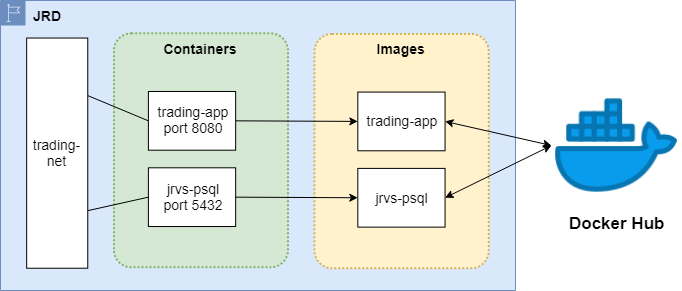
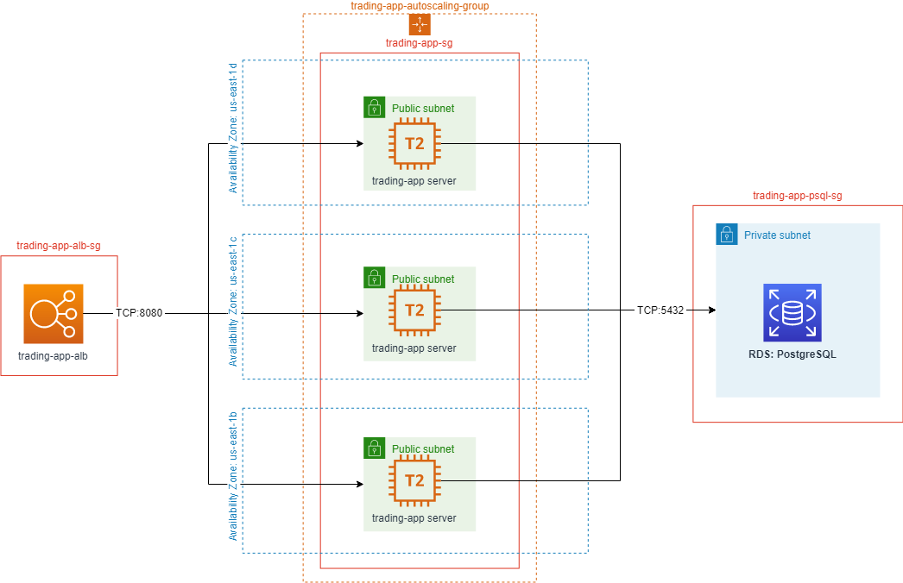

# Introduction
A walk through of how I deployed my trading-app project (https://github.com/davidmiquelf/trading-app) to AWS cloud.
First a manual deployment with Docker, then an automated one with Elastic Beanstalk and Jenkins.  

The trading-app simulates an API for posting, browsing, buying, and selling market quotes.
It runs on EC2 micro instances that each have access to the same PostgreSQL RDS (Amazon relational database service).  

# Docker
With Docker, each EC2 instance pulls the docker images from Dockerhub or Github, then creates
and runs the containers. They originally ran psql locally, but in later iterations they simply connected
to the RDS.


There are two Docker files, one in the base folder of trading-app, and the other in the psql folder.
## trading-app
The app is dockerized by the following lines from `/dll/run_docker_app.sh`:
```
docker build -t trading-app .

docker run -d \
--restart unless-stopped \
-e "PSQL_URL=$PSQL_URL" \
-e "PSQL_USER=$PSQL_USER" \
-e "PSQL_PASSWORD=$PSQL_PASSWORD" \
-e "IEX_PUB_TOKEN=$IEX_PUB_TOKEN" \
--name trading-app \
--network trading-net \
-p 8080:8080 -t trading-app
```
This command creates a trading-app image from the Dockerfile, then runs the container with specific environment variables.
## jrvs-psql
The psql database is dockerized by similar lines in the script `/dll/run_docker_psql.sh`:  
```
cd ../psql

docker build -t jrvs-psql .

docker run --name jrvs-psql \
--restart unless-stopped \
-e "POSTGRES_PASSWORD=$PSQL_PASSWORD" \
-e POSTGRES_DB=jrvstrading \
-e "POSTGRES_USER=$PSQL_USER" \
--network trading-net \
-d -p 5432:5432 jrvs-psql
```
The Dockerfile tells the image to inject the commands in `/psql/sql_dll/schema.sql` after creating the jrvstrading database,
so the database is fully ready after being dockerized.

# AWS Cloud

After setting up the server on a single EC2 instance, I created an image of the instance so that I could launch new server instances from a launch template. Then I set up a load balancer and an auto-scaling group to automatically launch/terminate instances depending on server load.



# Jenkins and Elastic Beanstalk

The problem with the above approach is the hassle of setting it up and the difficulty keeping all the instances up to date. If I want to use a newer version of my app, I basically need to log in to each instance and pull the latest docker image.  
Luckliy, Elastic Beanstalk (EB) can fully automate the process. After setting up an EB project with the desired environment variables and port forwards, I can simply upload a jar file of the latest version of my trading-app to have it run on all the automatically generated instances. Then, whenever I want to update my project I simply upload a new jar file.  

But there are two problems to consider: 
1. In a production environment I don't want to upload a jar file to find out it crashed all my servers.
2. I don't want every developer logging in to AWS and uploading their own jar files onto the same project.  

The first problem is easy: I created two EB projects -- tradingApp-dev and tradingApp-prod -- that way I could test my new jar files on the dev servers first.  

For the second problem, I used Jenkins: I made a new EC2 instance to host a Jenkins server behind an NGINX reverse proxy. I set up Jenkins to listen to the project's GitHub repo, pull new commits, build new jar files, then push them to EB. I set it up to listen to the dev branch for tradingApp-dev, and the master branch for tradingApp-prod.
  

